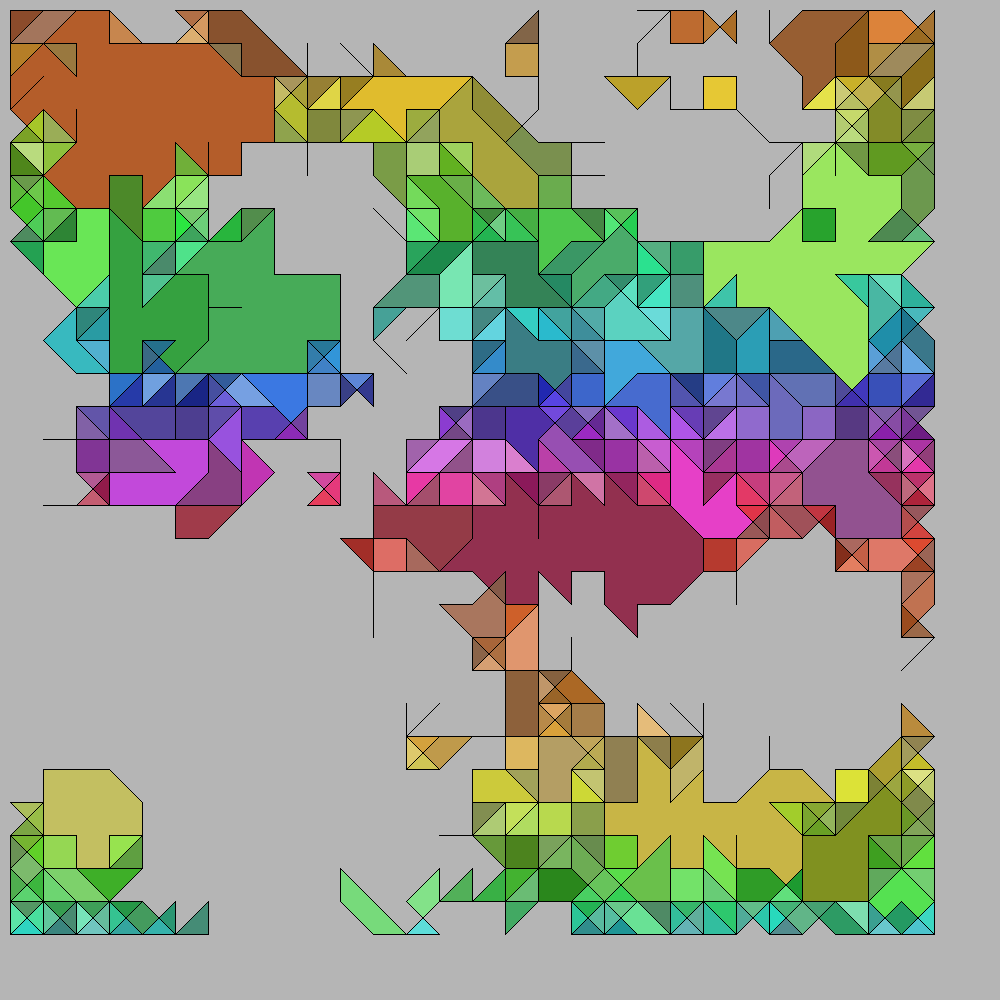

# Order and Error

A C++ project that creates an image based on simple random rules.
Inspired by Huw Landauer's (TikTok User @onlyhuwman) [system "Order and Error"](https://vm.tiktok.com/ZS3BEKVP/).
This works by generating a graph (either a determenistic grid with edges to the nearest neighbors or
randomly placed nodes with edges to other, near nodes).
Then the graph is randomly traversed and the used edges are "activated".
In the last step all closed surfaces are colored in a random color.

